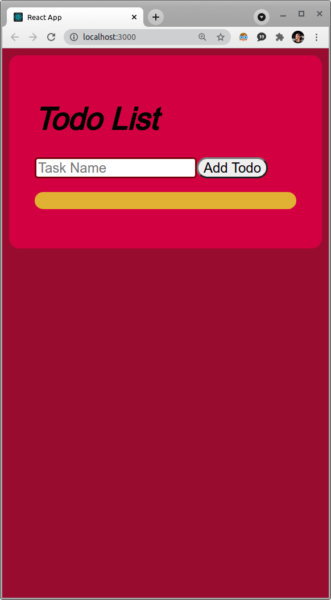
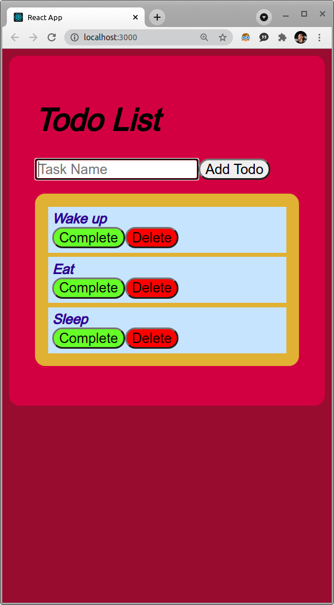
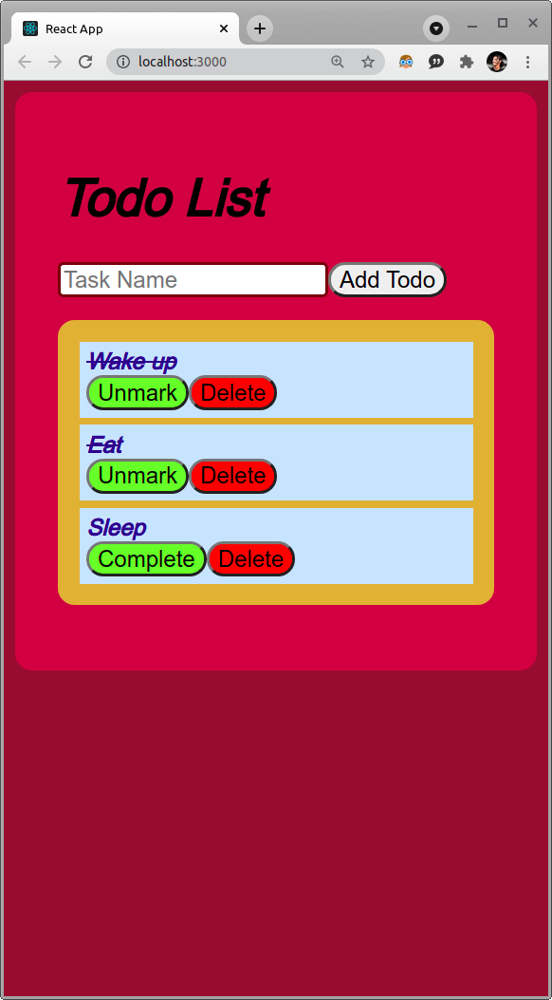

# React-Todo-App

## In an attempt to learn one of the most popular web frameworks - React, I've built a simple to-do list application that uses some of the core react features - reusable components, props, usestates, use effects, and storing data to local storage.

 

## Deployment

*View the app [here](https://showmickkar.github.io/React-Todo-App/)*

## Run the project on your computer

To clone the project 
``
    git clone https://github.com/ShowmickKar/React-Todo-App.git
``

Install dependencies 
``
npm install i
``

Run the project 
``
npm start
``

Screenshots: 

 
 

 
 

